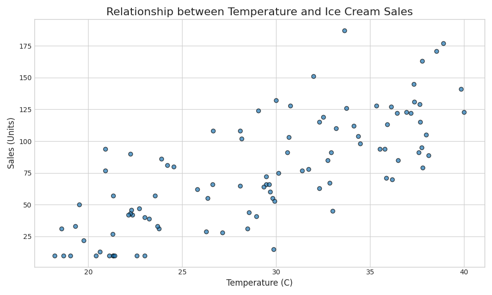

# Ice Cream Sales Prediction

This project develops a machine learning model to predict ice cream sales based on temperature. It serves as a practical demonstration of a complete MLOps workflow, including data generation, model training, experiment tracking with MLflow, and deployment as a REST API.



## Project Structure

```text
.
├── data/
│   ├── ice_cream_sales.csv       # Generated dataset
│   └── temperature_vs_sales.png  # EDA plot
├── mlruns/                       # MLflow experiment tracking data
├── app/
│   ├── main.py                   # FastAPI for real-time predictions
│   ├── explore_data.py           # Script for exploratory data analysis
│   ├── generate_data.py          # Script to generate the synthetic dataset
│   ├── train.py                  # Script for model training and MLflow logging
│   ├── azureml_pipeline.py       # Optional Azure ML pipeline creator/submission script
│   └── settings.py               # Centralized project settings (logging)
├── venv/                         # Python virtual environment
├── requirements.txt              # Python dependencies
└── run_pipeline.sh               # Bash script to run the entire pipeline
```

## Setup

1. **Create and activate a virtual environment:**

    ```bash
    python3 -m venv venv
    source venv/bin/activate
    ```

2. **Install the required dependencies:**

    ```bash
    pip install -r requirements.txt
    ```

3. **Optional centralized logging settings (applies to all scripts and API):**

    ```bash
    export LOG_LEVEL="INFO"
    export LOG_FORMAT="%(asctime)s | %(levelname)s | %(name)s | %(message)s"
    ```

## Running the Pipeline

This project includes a shell script to automate the entire machine learning workflow, from data generation to model training.

To run the full pipeline, execute the following command:

```bash
./run_pipeline.sh
```

This script will:

1. Generate the synthetic `ice_cream_sales.csv` dataset in the `data/` directory.
2. Perform an exploratory analysis and save a correlation plot to `data/`.
3. Train a linear regression model and log the experiment (parameters, metrics, and model artifact) to MLflow under the `Ice_Cream_Sales_Prediction` experiment.

To create and submit an Azure Machine Learning pipeline job instead of running locally:

```bash
./run_pipeline.sh --azureml-pipeline
```

You can also run each step directly with configurable arguments:

```bash
venv/bin/python -m app.generate_data --num-days 120 --output-path data/ice_cream_sales.csv
venv/bin/python -m app.explore_data --data-path data/ice_cream_sales.csv --plot-path data/temperature_vs_sales.png
venv/bin/python -m app.train --data-path data/ice_cream_sales.csv --experiment-name Ice_Cream_Sales_Prediction --cv-folds 5
```

## Tracking with Azure Machine Learning

By default, MLflow saves experiment data locally to the `mlruns` directory. This project is also configured to seamlessly integrate with an **Azure Machine Learning workspace** for more robust, cloud-based tracking.

To enable this, you must set the `AZURE_MLFLOW_URI` environment variable to your workspace's MLflow tracking URI.

1. **Find your Azure ML Tracking URI:**
    - Go to your Azure Machine Learning workspace in the Azure portal.
    - On the "Overview" page, find the "MLflow tracking URI" and copy it.

2. **Set the environment variable:**

    ```bash
    export AZURE_MLFLOW_URI="<your-azure-ml-tracking-uri>"
    ```

3. **Run the pipeline or API:**
    With the environment variable set, when you run `./run_pipeline.sh` or the FastAPI service, the scripts will automatically detect the URI and send all MLflow data to your Azure ML workspace instead of saving it locally.

4. **Create an Azure ML pipeline job (optional):**
    Set these environment variables before running `./run_pipeline.sh --azureml-pipeline`:

    ```bash
    export AZURE_SUBSCRIPTION_ID="<subscription-id>"
    export AZURE_RESOURCE_GROUP="<resource-group>"
    export AZURE_ML_WORKSPACE="<workspace-name>"
    export AZURE_ML_COMPUTE="<compute-cluster-name>"
    ```

    If Azure SDK dependencies are missing, install:

    ```bash
    pip install azure-ai-ml azure-identity
    ```

    The Azure ML pipeline now passes the generated dataset from the `generate_data` step to `explore_data` and `train_model` as an explicit pipeline artifact.

## Running the Prediction API

The trained model is served via a FastAPI-based REST API.

1. **Start the API with FastAPI CLI:**

    ```bash
    fastapi run app/main.py --host 0.0.0.0 --port 5001
    ```

    The server will start and load the best run by `r2` from the configured MLflow experiment.

    Optional API model-selection environment variables:

    ```bash
    export MLFLOW_EXPERIMENT_NAME="Ice_Cream_Sales_Prediction"
    export MLFLOW_MODEL_ARTIFACT_PATH="linear_regression_model"
    export MLFLOW_MIN_R2="0.0"
    ```

2. **Test the API:**
    Open another terminal and use `curl` to send a GET request to the `/predict` endpoint with a temperature value.

    ```bash
    curl "http://127.0.0.1:5001/predict?temperature=32"
    ```

    The API will respond with a JSON object containing the predicted sales:

    ```json
    {
      "provided_temperature": 32.0,
      "sales_prediction": 89.86
    }
    ```

3. **Test interactively with FastAPI docs:**
    After starting the API, open:

    ```text
    http://127.0.0.1:5001/docs
    ```

    Use the Swagger UI to run `/predict` and `/reload-model` requests directly from your browser.

4. **Reload the model without restarting the API:**

    ```bash
    curl -X POST "http://127.0.0.1:5001/reload-model"
    ```

## Viewing Experiments with MLflow

To explore the experiment runs, metrics, and saved model artifacts, use the MLflow UI.

1. **Launch the MLflow UI:**

    ```bash
    mlflow ui
    ```

2. Open your web browser and navigate to `http://127.0.0.1:5000`. You will find the `Ice_Cream_Sales_Prediction` experiment, which contains all the runs from the training script.

MLflow traces are also emitted for training and API operations (`load_model`, `predict`, `reload-model`). You can inspect them in the MLflow UI Traces view.
